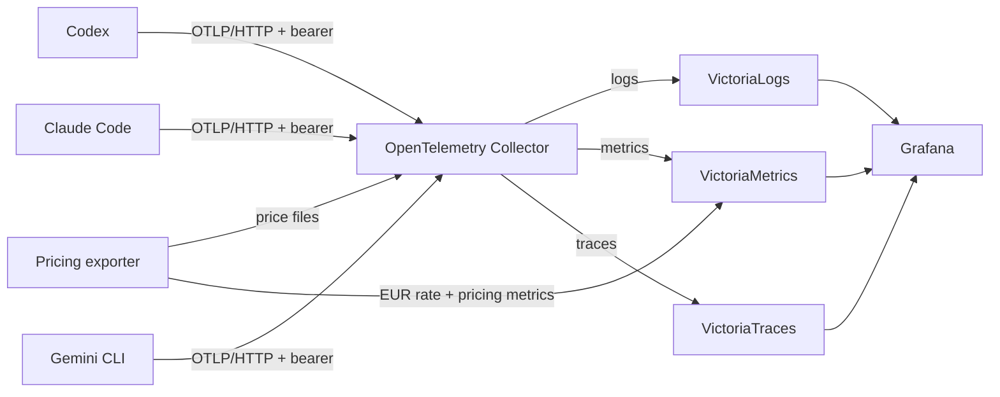

# AI CLI Observability

**See where your AI coding time, tokens, and money go.**

[](https://opentelemetry.io/)
[](https://grafana.com/)
[](https://docs.docker.com/compose/)
[](LICENSE)

AI CLI Observability turns the built-in telemetry from **Codex**, **Claude
Code**, and **Gemini CLI** into one self-hosted Grafana view. Track usage,
latency, errors, tokens, tool activity, traces, and estimated API-equivalent
cost without sending your telemetry to another SaaS.

> One Compose stack. Three AI CLIs. Full OpenTelemetry signals. Your data.

| Answer | Signal |
| --- | --- |
| Which CLI and model consume the most tokens? | Usage and token metrics |
| What would that activity cost through provider APIs? | USD and EUR estimates |
| Where do slow requests and failures happen? | Latency, errors, logs, and traces |
| Which tools are agents actually using? | Immutable tool events |

## Quick start

**You need:** Docker with Compose v2. Python 3.11 or newer is required only for
the smoke test.

Copy the environment template and generate two secrets:

```bash
cp .env.example .env
openssl rand -hex 32
openssl rand -hex 32
```

Paste one value into `OTEL_AUTH_TOKEN` in `.env` and the other into
`GRAFANA_ADMIN_PASSWORD`, then start the stack:

```bash
docker compose up -d --build
docker compose ps
```

Open <http://localhost:3000>, sign in with `admin` and your Grafana password,
then connect a client below. Grafana provisions the dashboard and all three
datasources automatically.

> [!NOTE]
> This repository is a sanitized, single-host version of a real setup. It
> contains no production telemetry, credentials, hostnames, private network
> addresses, or identity-provider configuration.

## What ships

- A ready-to-use `AI CLI Tools - Overview` Grafana dashboard
- Logs, metrics, and traces stored in the VictoriaMetrics stack
- Client examples for Codex, Claude Code, and Gemini CLI
- Collector-side Codex and Gemini cost estimation
- Native Claude Code cost metrics
- Live USD-to-EUR conversion for dashboard totals
- Pinned container images and the VictoriaLogs Grafana plugin
- An optional credit-reset dashboard for custom exporters

## Architecture



The collector accepts OTLP/HTTP only:

- `/v1/logs` -> VictoriaLogs
- `/v1/metrics` -> VictoriaMetrics through Prometheus remote write
- `/v1/traces` -> VictoriaTraces

Grafana and OTLP bind to `127.0.0.1` by default. Storage services are reachable
only inside the Compose network.

## Prerequisites

- Docker with Compose v2
- Python 3.11 or newer for the smoke test
- `uv` and Python 3.13 or newer for local pricing-exporter tests
- Internet access to pull images and the Grafana VictoriaLogs plugin, and to
  refresh the exchange rate

## Configure clients

The examples use `http://localhost:4318`. Export the collector token in the
same process environment as the CLI:

```bash
export OTEL_AUTH_TOKEN="value-from-your-dot-env"
```

### Codex

Merge [`clients/codex/config.toml.example`](clients/codex/config.toml.example)
into `~/.codex/config.toml`. The example enables logs, metrics, traces, and
runtime metrics while keeping raw prompt bodies disabled.

Codex exporter endpoints include their complete `/v1/...` paths.

### Claude Code

Review and source
[`clients/claude-code/telemetry.env.example`](clients/claude-code/telemetry.env.example)
before starting `claude`:

```bash
source clients/claude-code/telemetry.env.example
claude
```

Claude Code defaults to delta metric temporality. This setup selects cumulative
temporality because Prometheus remote write cannot represent delta points.

### Gemini CLI

Review and source
[`clients/gemini-cli/telemetry.env.example`](clients/gemini-cli/telemetry.env.example)
before starting Gemini CLI. The file also contains an equivalent
`settings.json` example. Keep the bearer header in the environment.

Gemini traces can contain more context than logs and metrics. Disable
`GEMINI_TELEMETRY_TRACES_ENABLED` if that is not acceptable for your data.

## Privacy and security

Prompt logging is disabled in all examples. That does not make arbitrary
telemetry harmless: model names, session identifiers, tool activity, errors,
and trace attributes can still disclose operational context.

- Use a unique, random bearer token.
- Keep `.env` and client configuration files containing secrets out of Git.
- Restrict Grafana and storage backends to trusted networks.
- Review emitted fields before increasing retention or adding users.
- Do not enable prompt, tool-detail, or raw-body logging without an explicit
  retention and access policy.
- Treat Grafana screenshots as data exports; inspect them before publication.

The collector's bearer token protects ingestion, not Grafana. Grafana uses its
own administrator password.

## Remote agents

The default Compose file is deliberately local-only. For remote agents, put a
TLS-terminating reverse proxy in front of collector port `4318`, expose only
that port, and keep VictoriaMetrics, VictoriaLogs, and VictoriaTraces private.
A private overlay network or firewall allowlist should limit who can reach the
proxy.

Change client endpoints to `https://otel.example.com` while retaining the
signal paths. Do not expose unauthenticated OTLP over plain HTTP.

## Dashboard

The main dashboard combines:

- LogsQL over immutable request and tool events in VictoriaLogs
- PromQL over native CLI metrics in VictoriaMetrics
- Pricing enrichment attributes added by the collector

Traces are available through the provisioned VictoriaTraces datasource in
Grafana Explore. The core dashboard has no dependency on account-specific
credit schedules.

The optional [`extras/credit-resets`](extras/credit-resets/) dashboard expects
a separate custom metric and stays outside automatic provisioning.

### Publish on Grafana.com

1. Load the provisioned dashboard and confirm its panels against real,
   sanitized data.
2. In the dashboard toolbar, select **Export** and then **Export as code**.
3. Under **Advanced options**, choose the **Classic** model.
4. Enable **Share dashboard with another instance** to remove local deployment
   details, then download the JSON file.
5. Sign in to Grafana.com, open **My dashboards**, and select
   **Upload dashboard**.
6. Upload the JSON, complete the metadata, and select **Save and Publish**.

Do not upload `.env`, Grafana's database, screenshots with private labels, or a
raw API response. Grafana documents the current process in
[Share dashboards and panels](https://grafana.com/docs/grafana-cloud/visualizations/dashboards/share-dashboards-panels/#publish-a-community-dashboard).

## Cost estimation

Claude Code emits native cost data. Codex and Gemini estimates are calculated
from token events and model prices supplied by the pinned LiteLLM data set,
with narrow official fallbacks for models missing from that set. The pricing
exporter also records pricing history in SQLite and exposes the USD-to-EUR rate
to VictoriaMetrics.

These values are estimates, not invoices. Provider pricing, service tiers,
long-context multipliers, promotions, and model aliases change. The collector
stores a `pricing_as_of` attribute so old telemetry remains interpretable.

## Verification

Static checks:

```bash
docker compose config -q
jq empty grafana/dashboards/*.json extras/credit-resets/*.json
uv --directory pricing-exporter sync --frozen
uv --directory pricing-exporter run python -m unittest discover -s tests
```

Runtime smoke test after `docker compose up -d --build`:

```bash
set -a
. ./.env
set +a
python3 scripts/smoke.py
```

The smoke test checks OTLP authentication, all three signal submissions,
Grafana dashboard provisioning, VictoriaLogs ingestion, VictoriaMetrics
ingestion, and datasource registration. It writes only synthetic records named
`ai-cli-observability-smoke`.

Stop containers without deleting data:

```bash
docker compose down
```

`docker compose down -v` permanently deletes this stack's local telemetry and
Grafana state.

## Reference documentation

- [Codex configuration reference](https://developers.openai.com/codex/config-reference/)
- [Claude Code monitoring](https://code.claude.com/docs/en/monitoring-usage)
- [Gemini CLI telemetry](https://google-gemini.github.io/gemini-cli/docs/cli/telemetry.html)
- [VictoriaMetrics OpenTelemetry ingestion](https://docs.victoriametrics.com/victoriametrics/integrations/opentelemetry/)
- [VictoriaTraces OpenTelemetry ingestion](https://docs.victoriametrics.com/victoriatraces/data-ingestion/opentelemetry/)
- [Grafana provisioning](https://grafana.com/docs/grafana/latest/administration/provisioning/)

## License

Apache License 2.0. See [`LICENSE`](LICENSE).
